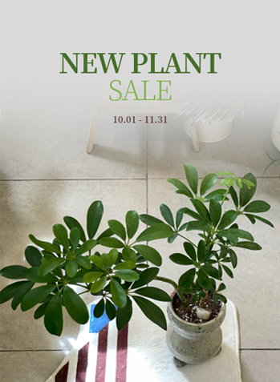
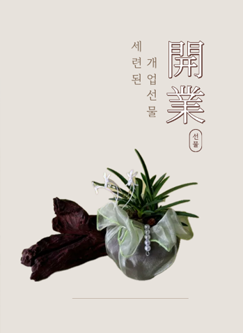
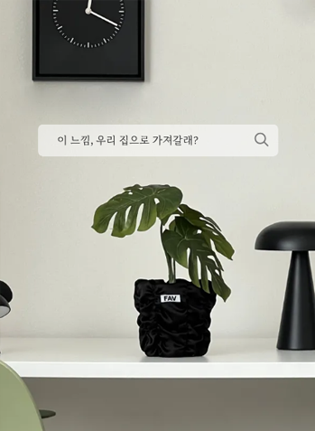

## 📌 Project Overview
웹 개발 학습 초기에 제작한 적응형 쇼핑몰 프로젝트로, 브랜드 기획과 콘셉트 설정부터 디자인 및 퍼블리싱까지 전 과정을 단독으로 진행했습니다. JavaScript 없이 CSS만으로 구현한 웹사이트입니다.

## ⏱️ Development Period
코딩기간 : 2025.10.24 ~ 25/11/14(22일)

## 🛠️ Tech Stack
1. HTML3
2. CSS

****************************************************

/* 서브베너 캐러셀 html */
```html
<div class="banner_zone">
    <div class="visual_main">
      
    </div> <!--visual_main-->

    <div class="sub_banner">
      <input type="radio" name="s_banner" id="s_banner01" checked>
      <input type="radio" name="s_banner" id="s_banner02">
      <input type="radio" name="s_banner" id="s_banner03">

      <div class="sheet">
        <div class="bn_sheet01">
          <a href="./detail/detail.html" class="sh01_img">
            
          </a>

          <label for="s_banner03" class="sh01_left"></label>
          <label for="s_banner02" class="sh01_right"></label>
        </div> <!--bn_sheet01-->

        <div class="bn_sheet02">

          <a href="./detail/detail.html" class="sh02_img">
            
          </a>


          <label for="s_banner01" class="sh02_left"></label>
          <label for="s_banner03" class="sh02_right"></label>
        </div> <!--bn_sheet02-->

        <div class="bn_sheet03">

          <a href="./detail/detail.html" class="sh03_img">
            
          </a>


          <label for="s_banner02" class="sh03_left"></label>
          <label for="s_banner01" class="sh03_right"></label>
        </div> <!--bn_sheet03-->

      </div><!--sheet-->


      <div class="indi">
        <label for="s_banner01"></label>
        <label for="s_banner02"></label>
        <label for="s_banner03"></label>
      </div>
    </div> <!--sub_banner-->
  </div> <!--banner_zone-->
```
/* 서브베너 캐러셀 css */
```css
/*****************   banner_zone    *****************/
.banner_zone {
  width: 1077px; height: 477px;
  margin: 0 auto;
  display: flex;
  justify-content: space-between;
  margin-bottom: 70px;
}

.banner_zone .visual_main {
  width: 713px;
}
.banner_zone .visual_main img{
  width: 100%; 
}

.banner_zone .sub_banner {
  width: 349px;
  position: relative;
}
#s_banner01, #s_banner02, #s_banner03 {
  display: none;
}

.sheet>div {display: none;}

#s_banner01:checked ~ .sheet .bn_sheet01 {display: block;}
#s_banner02:checked ~ .sheet .bn_sheet02 {display: block;}
#s_banner03:checked ~ .sheet .bn_sheet03 {display: block;}

#s_banner01:checked ~ .indi label:nth-child(1),
#s_banner02:checked ~ .indi label:nth-child(2),
#s_banner03:checked ~ .indi label:nth-child(3) {
  background-color: #00980A;
}

.banner_zone .sub_banner .indi{
  display: flex;
  position: absolute;
  bottom: 10px;
  left: calc(50% - 30px);
}
.banner_zone .sub_banner .indi label {
    display: inline-block;
    width: 15px; 
    height: 15px;
    border-radius: 50%; 
    background-color: #ccc;
    cursor: pointer;
    margin-right: 5px;
  }


/*************  bn_sheet01  ***********/
.banner_zone .sub_banner .bn_sheet01 {
  position: relative;
}
.sub_banner .bn_sheet01 .sh01_img {
  display: block;
  width: 349px;
  overflow: hidden;
}
.sh01_img img {
  width: 100%;
}

.banner_zone .sub_banner .bn_sheet01 .sh01_left {
  width: 48px; height: 48px;
  position: absolute;
  top: calc(50% - 48px); left: -15px;
  cursor: pointer;
  background-image: url('./img/arrow_left_icon.png');
  background-size: cover;
}
.banner_zone .sub_banner .bn_sheet01 .sh01_left:hover {
  background-image: url('./img/arrow_left_icon_hover.png');
  background-size: cover;
}
.banner_zone .sub_banner .bn_sheet01 .sh01_right {
  width: 48px; height: 48px;
  position: absolute;
  top: calc(50% - 48px); right: -15px;
  cursor: pointer;
  background-image: url('./img/arrow_right_icon.png');
  background-size: cover;
}
.banner_zone .sub_banner .bn_sheet01 .sh01_right:hover {
  background-image: url('./img/arrow_right_icon_hover.png');
  background-size: cover;
}
…
```
